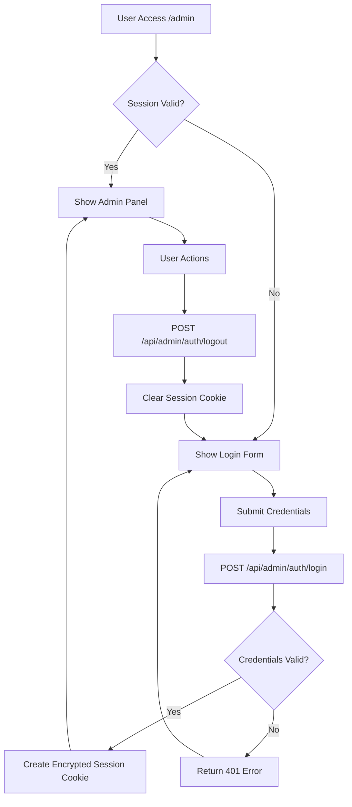
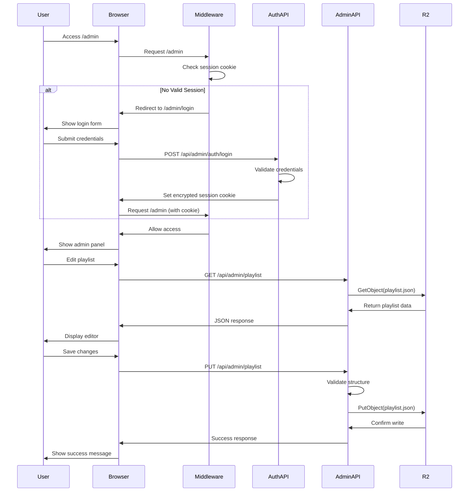
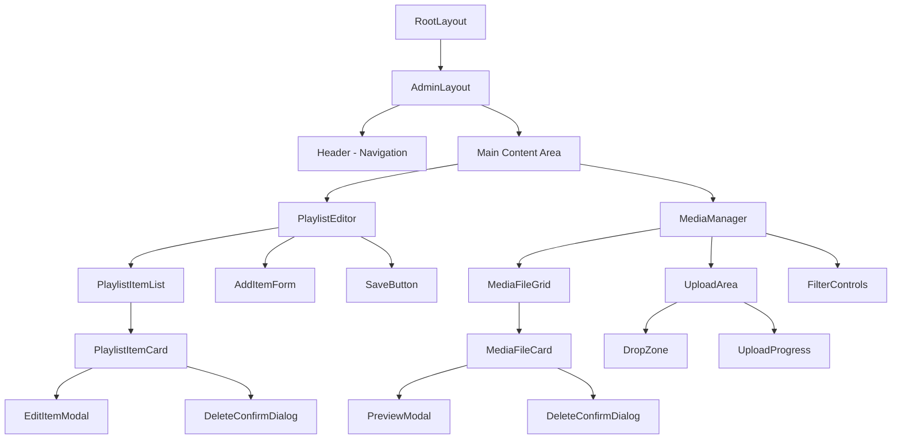
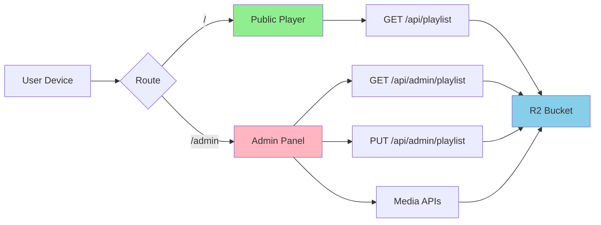

# Admin Panel Architecture - LCD Signage System

## 1. Executive Summary

This document details the architecture for a management panel to be integrated into the existing LCD signage Next.js application. The panel will enable administrators to manage playlist configurations and media files stored in Cloudflare R2, secured with HTTP Basic Authentication and session-based access control.

### Key Design Principles
- **Simplicity**: Single-user authentication without database complexity
- **Security**: HTTP Basic Auth with session management and CSRF protection
- **Compatibility**: Seamless integration with existing Next.js 16.1.6 App Router architecture
- **Maintainability**: Clear separation between public player and admin functionality

---

## 2. Authentication Strategy

### 2.1 Authentication Flow



### 2.2 Implementation Details

#### Session Management
- **Technology**: Encrypted HTTP-only cookies using `iron-session` library
- **Session Storage**: Cookie-based (no server-side state required)
- **Session Lifetime**: 24 hours with automatic expiration
- **Cookie Configuration**:
  - `httpOnly: true` - Prevents XSS attacks
  - `secure: true` - HTTPS only (production)
  - `sameSite: 'lax'` - CSRF protection
  - `maxAge: 86400` - 24 hour expiration

#### Credentials Storage
- **Username**: Stored in `ADMIN_USERNAME` environment variable
- **Password**: Stored in `ADMIN_PASSWORD` environment variable
- **Validation**: Direct comparison (environment-based, no hashing needed for single user)
- **Future Enhancement**: Password hashing with bcrypt if multiple users needed

#### Session Data Structure
```typescript
interface SessionData {
  isAuthenticated: boolean;
  username: string;
  loginTime: number;
  expiresAt: number;
}
```

### 2.3 Middleware Protection

A Next.js middleware will protect all `/admin/*` routes except the login page:

**File**: `middleware.ts` (project root)

```typescript
import { NextResponse } from 'next/server';
import type { NextRequest } from 'next/server';

export function middleware(request: NextRequest) {
  const path = request.nextUrl.pathname;
  
  // Public paths (no authentication required)
  if (path === '/' || 
      path.startsWith('/api/playlist') || 
      path.startsWith('/_next') ||
      path.startsWith('/manifest.json') ||
      path.startsWith('/sw.js')) {
    return NextResponse.next();
  }
  
  // Admin login page (accessible without auth)
  if (path === '/admin/login') {
    return NextResponse.next();
  }
  
  // All other /admin routes require authentication
  if (path.startsWith('/admin')) {
    const session = request.cookies.get('admin_session');
    
    if (!session) {
      return NextResponse.redirect(new URL('/admin/login', request.url));
    }
    
    // Session validation happens in API routes
    return NextResponse.next();
  }
  
  return NextResponse.next();
}

export const config = {
  matcher: [
    '/((?!_next/static|_next/image|favicon.ico|icon-.*\\.png).*)',
  ],
};
```

---

## 3. API Routes Architecture

### 3.1 API Endpoint Overview

| Endpoint | Method | Authentication | Purpose |
|----------|--------|----------------|---------|
| `/api/admin/auth/login` | POST | Public | Authenticate user and create session |
| `/api/admin/auth/logout` | POST | Required | Destroy session |
| `/api/admin/auth/verify` | GET | Required | Verify session validity |
| `/api/admin/playlist` | GET | Required | Retrieve current playlist.json |
| `/api/admin/playlist` | PUT | Required | Update playlist.json |
| `/api/admin/media` | GET | Required | List all media files in R2 |
| `/api/admin/media/upload` | POST | Required | Upload new media file |
| `/api/admin/media/[key]` | DELETE | Required | Delete specific media file |

### 3.2 Authentication Endpoints

#### POST /api/admin/auth/login

**Request Body**:
```json
{
  "username": "admin",
  "password": "securepassword"
}
```

**Success Response (200)**:
```json
{
  "success": true,
  "message": "Authenticated successfully"
}
```

**Error Response (401)**:
```json
{
  "success": false,
  "error": "Invalid credentials"
}
```

**Implementation Notes**:
- Rate limiting: Max 5 attempts per IP per 15 minutes
- Timing attack mitigation: Constant-time comparison
- Sets encrypted session cookie on success

#### POST /api/admin/auth/logout

**Success Response (200)**:
```json
{
  "success": true,
  "message": "Logged out successfully"
}
```

**Implementation Notes**:
- Clears session cookie
- Always returns success (idempotent)

#### GET /api/admin/auth/verify

**Success Response (200)**:
```json
{
  "authenticated": true,
  "username": "admin",
  "expiresAt": 1742712000000
}
```

**Error Response (401)**:
```json
{
  "authenticated": false
}
```

### 3.3 Playlist Management Endpoints

#### GET /api/admin/playlist

**Success Response (200)**:
```json
{
  "playlist": [
    {
      "type": "image",
      "src": "media/image1.jpg",
      "duration": 10
    },
    {
      "type": "video",
      "src": "media/video1.mp4"
    }
  ]
}
```

**Error Response (500)**:
```json
{
  "error": "Failed to fetch playlist from R2"
}
```

**Implementation Notes**:
- Fetches directly from R2 using `GetObjectCommand`
- Returns raw playlist.json content

#### PUT /api/admin/playlist

**Request Body**:
```json
{
  "playlist": [
    {
      "type": "image",
      "src": "media/updated-image.jpg",
      "duration": 15
    }
  ]
}
```

**Validation Rules**:
- Must be valid JSON
- Must have `playlist` array property
- Each item must have `src` and `type`
- Type must be "image" or "video"
- Duration (if present) must be positive number

**Success Response (200)**:
```json
{
  "success": true,
  "message": "Playlist updated successfully"
}
```

**Error Response (400)**:
```json
{
  "error": "Invalid playlist structure",
  "details": ["Item 0 missing required field: src"]
}
```

**Implementation Notes**:
- Uses `PutObjectCommand` to update R2
- Validates structure before saving
- Sets `ContentType: application/json`
- Includes cache-busting headers

### 3.4 Media Management Endpoints

#### GET /api/admin/media

**Query Parameters**:
- `prefix` (optional): Filter by path prefix (e.g., "media/")
- `maxKeys` (optional): Limit results (default: 1000)

**Success Response (200)**:
```json
{
  "files": [
    {
      "key": "media/image1.jpg",
      "size": 245678,
      "lastModified": "2026-03-20T10:30:00Z",
      "contentType": "image/jpeg"
    },
    {
      "key": "media/video1.mp4",
      "size": 15234567,
      "lastModified": "2026-03-22T14:15:00Z",
      "contentType": "video/mp4"
    }
  ],
  "totalCount": 2
}
```

**Implementation Notes**:
- Uses `ListObjectsV2Command`
- Filters to show only media files (not playlist.json)
- Returns file metadata for UI display

#### POST /api/admin/media/upload

**Request Format**: `multipart/form-data`

**Form Fields**:
- `file`: File upload (required)
- `path`: Target path in R2 (optional, defaults to "media/")

**Validation Rules**:
- Max file size: 500MB
- Allowed extensions: `.jpg`, `.jpeg`, `.png`, `.webp`, `.gif`, `.mp4`, `.webm`, `.mov`
- Filename sanitization: Remove special characters, spaces

**Success Response (200)**:
```json
{
  "success": true,
  "key": "media/uploaded-file.jpg",
  "url": "https://lcd-cdn.yeninesilkurs.tr/media/uploaded-file.jpg",
  "size": 245678
}
```

**Error Response (400)**:
```json
{
  "error": "Invalid file type. Allowed: jpg, jpeg, png, webp, gif, mp4, webm, mov"
}
```

**Error Response (413)**:
```json
{
  "error": "File too large. Maximum size: 500MB"
}
```

**Implementation Notes**:
- Uses `PutObjectCommand` with streaming
- Auto-detects `ContentType` from file extension
- Returns full CDN URL for immediate use
- Generates unique filename if collision detected

#### DELETE /api/admin/media/[key]

**URL Parameter**:
- `key`: File key in R2 (URL-encoded)

**Example**: `DELETE /api/admin/media/media%2Fimage1.jpg`

**Success Response (200)**:
```json
{
  "success": true,
  "message": "File deleted successfully",
  "key": "media/image1.jpg"
}
```

**Error Response (404)**:
```json
{
  "error": "File not found"
}
```

**Error Response (403)**:
```json
{
  "error": "Cannot delete system files (playlist.json, placeholder.txt)"
}
```

**Implementation Notes**:
- Uses `DeleteObjectCommand`
- Prevents deletion of critical files (playlist.json)
- Validates key format before deletion

### 3.5 Data Flow Diagram



---

## 4. Admin Panel UI Architecture

### 4.1 Page Structure

```
/admin/
├── login/              # Public - Login page
│   └── page.tsx       
├── layout.tsx         # Admin layout wrapper
├── page.tsx           # Dashboard (redirect to /admin/playlist)
├── playlist/          # Playlist editor page
│   └── page.tsx
└── media/             # Media manager page
    └── page.tsx
```

### 4.2 Component Hierarchy



### 4.3 Page Components

#### `/admin/login/page.tsx`
**Purpose**: Authentication entry point

**Features**:
- Username and password input fields
- Form validation (client-side)
- Error message display
- Loading state during authentication
- Remember session across browser tabs
- Redirect to `/admin/playlist` on success

**UI Elements**:
- Centered card layout
- Logo/branding
- Input fields with labels
- Submit button with loading spinner
- Error alert banner

#### `/admin/layout.tsx`
**Purpose**: Consistent layout for authenticated admin pages

**Features**:
- Top navigation bar with logo
- Active route highlighting
- Logout button
- Responsive sidebar (mobile: hamburger menu)
- Session timeout warning

**Navigation Structure**:
```
[Logo] LCD Signage Admin
├── Playlist Editor
├── Media Manager
└── [Logout Button]
```

#### `/admin/playlist/page.tsx`
**Purpose**: Visual playlist editor

**Features**:
- Drag-and-drop reordering of playlist items
- Add new item button
- Edit item inline or in modal
- Delete item with confirmation
- Preview media files (thumbnail for images, play icon for videos)
- Duration slider for images (1-120 seconds)
- Media source autocomplete (from available R2 files)
- Save changes button with confirmation
- Revert/discard changes
- Real-time validation feedback

**Layout**:
```
┌─────────────────────────────────────────────┐
│ Playlist Editor                   [Save]    │
├─────────────────────────────────────────────┤
│                                             │
│  [+ Add Item]                               │
│                                             │
│  ┌──────────────────────────────────────┐  │
│  │ 🖼️ Image: media/image1.jpg          │  │
│  │ Duration: [====●=====] 10s          │  │
│  │                    [Edit] [Delete]  │  │
│  └──────────────────────────────────────┘  │
│                                             │
│  ┌──────────────────────────────────────┐  │
│  │ 🎥 Video: media/video1.mp4          │  │
│  │ Auto duration                       │  │
│  │                    [Edit] [Delete]  │  │
│  └──────────────────────────────────────┘  │
│                                             │
└─────────────────────────────────────────────┘
```

#### `/admin/media/page.tsx`
**Purpose**: Media file management interface

**Features**:
- Grid view of uploaded media files
- File upload via drag-and-drop or file picker
- Upload progress indicator
- Thumbnail preview for images
- Video play icon for videos
- File details: name, size, upload date
- Delete with confirmation dialog
- Search/filter files by name
- Sort by: name, date, size, type
- Copy CDN URL to clipboard
- Bulk selection and deletion

**Layout**:
```
┌─────────────────────────────────────────────┐
│ Media Manager                               │
├─────────────────────────────────────────────┤
│                                             │
│  ┌─────────────────────────────────────┐   │
│  │ 📤 Drag files here or click to      │   │
│  │    browse (Max 500MB)               │   │
│  └─────────────────────────────────────┘   │
│                                             │
│  [Search: ___________] [Filter: All ▼]     │
│                                             │
│  ┌──────┐  ┌──────┐  ┌──────┐             │
│  │ 🖼️   │  │ 🎥   │  │ 🖼️   │             │
│  │image1│  │video1│  │image2│             │
│  │245 KB│  │15 MB │  │312 KB│             │
│  │[Del] │  │[Del] │  │[Del] │             │
│  └──────┘  └──────┘  └──────┘             │
│                                             │
└─────────────────────────────────────────────┘
```

### 4.4 Shared UI Components

#### `<AdminHeader />`
- Site branding
- Navigation menu
- User indicator (username)
- Logout button

#### `<PlaylistItemCard />`
- Media thumbnail/icon
- File path display
- Type badge (image/video)
- Duration control (for images)
- Edit and delete actions

#### `<MediaFileCard />`
- Thumbnail preview
- File metadata
- Action buttons (delete, copy URL)
- Selection checkbox (for bulk operations)

#### `<UploadZone />`
- Drag-and-drop area
- File picker button
- File type validation
- Upload progress bar
- Error handling

#### `<ConfirmDialog />`
- Reusable confirmation modal
- Customizable title and message
- Confirm and cancel buttons
- Destructive action styling (red for deletes)

### 4.5 UI Framework Recommendation

Given the existing project uses **React 19** with no UI framework, I recommend **Tailwind CSS** for styling:

**Rationale**:
- Zero runtime overhead (utility-first CSS)
- Excellent Next.js integration
- No additional JavaScript bundle size
- Fast development with pre-built utilities
- Easy to customize for simple admin interface
- Responsive design out of the box

**Alternative**: Use native CSS modules (already supported in Next.js) if you want to avoid external dependencies.

**Installation Required**:
```bash
npm install -D tailwindcss postcss autoprefixer
npx tailwindcss init -p
```

**Configuration** (`tailwind.config.js`):
```javascript
module.exports = {
  content: [
    './app/admin/**/*.{js,ts,jsx,tsx}',
  ],
  theme: {
    extend: {},
  },
  plugins: [],
}
```

---

## 5. Security Measures

### 5.1 Authentication Security

#### Session Security
- **Encryption**: `iron-session` uses AES-256-GCM encryption
- **Secret Key**: 32+ character random string in `SESSION_SECRET` env var
- **Cookie Flags**: `httpOnly`, `secure`, `sameSite`
- **Expiration**: Automatic 24-hour timeout

#### Credential Security
- **Environment Storage**: Credentials never hardcoded
- **No Transmission**: Credentials only compared server-side
- **Rate Limiting**: Login endpoint restricted to 5 attempts per 15 min
- **Timing Attacks**: Use constant-time comparison for passwords

### 5.2 CSRF Protection

**Strategy**: Synchronizer Token Pattern

**Implementation**:
1. Generate CSRF token on login and store in session
2. Include token in all forms as hidden field
3. Validate token on all mutating requests (POST, PUT, DELETE)
4. Token rotation after successful operations

**Token Format**:
```typescript
interface CSRFToken {
  value: string;        // Random 32-byte hex string
  createdAt: number;    // Timestamp
  expiresAt: number;    // Timestamp (1 hour)
}
```

**Validation Flow**:
```typescript
// In API routes
async function validateCSRF(request: NextRequest) {
  const sessionToken = getSessionCSRF(request);
  const requestToken = request.headers.get('x-csrf-token');
  
  if (!sessionToken || !requestToken) {
    throw new Error('CSRF token missing');
  }
  
  if (sessionToken !== requestToken) {
    throw new Error('CSRF token invalid');
  }
  
  if (Date.now() > sessionToken.expiresAt) {
    throw new Error('CSRF token expired');
  }
}
```

### 5.3 File Upload Validation

#### File Type Validation
```typescript
const ALLOWED_MIME_TYPES = [
  'image/jpeg',
  'image/png',
  'image/webp',
  'image/gif',
  'video/mp4',
  'video/webm',
  'video/quicktime', // .mov
];

const ALLOWED_EXTENSIONS = [
  'jpg', 'jpeg', 'png', 'webp', 'gif',
  'mp4', 'webm', 'mov'
];

function validateFile(file: File): void {
  // Extension check
  const ext = file.name.split('.').pop()?.toLowerCase();
  if (!ext || !ALLOWED_EXTENSIONS.includes(ext)) {
    throw new Error('Invalid file extension');
  }
  
  // MIME type check
  if (!ALLOWED_MIME_TYPES.includes(file.type)) {
    throw new Error('Invalid file type');
  }
  
  // Size check (500MB)
  const MAX_SIZE = 500 * 1024 * 1024;
  if (file.size > MAX_SIZE) {
    throw new Error('File too large');
  }
}
```

#### Filename Sanitization
```typescript
function sanitizeFilename(filename: string): string {
  return filename
    .toLowerCase()
    .replace(/[^a-z0-9.-]/g, '-')  // Replace special chars
    .replace(/-+/g, '-')            // Remove duplicate dashes
    .replace(/^-|-$/g, '')          // Trim dashes
    .substring(0, 100);             // Max length
}
```

#### Path Traversal Prevention
```typescript
function validatePath(path: string): void {
  // Prevent directory traversal
  if (path.includes('..') || path.includes('//')) {
    throw new Error('Invalid path');
  }
  
  // Must start with media/
  if (!path.startsWith('media/')) {
    throw new Error('Files must be uploaded to media/ directory');
  }
}
```

### 5.4 Rate Limiting

**Implementation Strategy**: In-memory rate limiting using `Map`

**Limits**:
- Login endpoint: 5 requests per 15 minutes per IP
- Upload endpoint: 10 requests per 5 minutes per session
- Other admin endpoints: 60 requests per minute per session

**Implementation** (`app/services/rate-limiter.ts`):
```typescript
interface RateLimitEntry {
  count: number;
  resetAt: number;
}

const rateLimitMap = new Map<string, RateLimitEntry>();

export function checkRateLimit(
  key: string,
  maxAttempts: number,
  windowMs: number
): boolean {
  const now = Date.now();
  const entry = rateLimitMap.get(key);
  
  if (!entry || now > entry.resetAt) {
    rateLimitMap.set(key, {
      count: 1,
      resetAt: now + windowMs
    });
    return true;
  }
  
  if (entry.count >= maxAttempts) {
    return false;
  }
  
  entry.count++;
  return true;
}

// Cleanup old entries every 5 minutes
setInterval(() => {
  const now = Date.now();
  for (const [key, entry] of rateLimitMap.entries()) {
    if (now > entry.resetAt) {
      rateLimitMap.delete(key);
    }
  }
}, 5 * 60 * 1000);
```

**Usage in API Route**:
```typescript
export async function POST(request: NextRequest) {
  const ip = request.ip || 'unknown';
  
  if (!checkRateLimit(`login:${ip}`, 5, 15 * 60 * 1000)) {
    return NextResponse.json(
      { error: 'Too many login attempts. Try again later.' },
      { status: 429 }
    );
  }
  
  // Process login...
}
```

### 5.5 Input Validation & Sanitization

#### Playlist Validation
```typescript
function validatePlaylist(data: unknown): Playlist {
  if (!data || typeof data !== 'object') {
    throw new Error('Invalid playlist format');
  }
  
  const playlist = data as Playlist;
  
  if (!Array.isArray(playlist.playlist)) {
    throw new Error('Playlist must be an array');
  }
  
  for (const [index, item] of playlist.playlist.entries()) {
    if (!item.src || typeof item.src !== 'string') {
      throw new Error(`Item ${index}: missing or invalid src`);
    }
    
    if (!item.type || !['image', 'video'].includes(item.type)) {
      throw new Error(`Item ${index}: invalid type`);
    }
    
    if (item.duration !== undefined) {
      const duration = Number(item.duration);
      if (isNaN(duration) || duration <= 0) {
        throw new Error(`Item ${index}: invalid duration`);
      }
    }
  }
  
  return playlist;
}
```

### 5.6 Content Security Policy (CSP)

Add CSP headers to admin routes:

```typescript
// In app/admin/layout.tsx or middleware
export const headers = {
  'Content-Security-Policy': [
    "default-src 'self'",
    "script-src 'self' 'unsafe-inline'", // Next.js requires unsafe-inline
    "style-src 'self' 'unsafe-inline'",
    "img-src 'self' data: https://lcd-cdn.yeninesilkurs.tr",
    "media-src 'self' https://lcd-cdn.yeninesilkurs.tr",
    "connect-src 'self'",
    "font-src 'self'",
    "object-src 'none'",
    "base-uri 'self'",
    "form-action 'self'",
    "frame-ancestors 'none'",
  ].join('; ')
};
```

---

## 6. Environment Variables

### 6.1 New Variables to Add

Add to `.env` file:

```bash
# ─── Admin Panel Authentication ───
ADMIN_USERNAME=admin
ADMIN_PASSWORD=your_secure_password_here_min_16_chars

# ─── Session Management ───
SESSION_SECRET=your_32_character_random_secret_key_here_use_openssl_rand_hex_32

# ─── Security Settings ───
# Rate limiting for login attempts (optional, defaults shown)
RATE_LIMIT_LOGIN_MAX=5
RATE_LIMIT_LOGIN_WINDOW_MS=900000

# Maximum upload file size in bytes (optional, default 500MB)
MAX_UPLOAD_SIZE=524288000

# Session timeout in seconds (optional, default 24 hours)
SESSION_MAX_AGE=86400
```

### 6.2 Updated .env.example

```bash
# ─── CDN Configuration ───
NEXT_PUBLIC_CDN_BASE_URL=https://lcd-cdn.yeninesilkurs.tr
NEXT_PUBLIC_PLAYLIST_PATH=playlist.json

# ─── Player Settings ───
NEXT_PUBLIC_DEFAULT_IMAGE_DURATION=15
NEXT_PUBLIC_PLAYLIST_RELOAD_INTERVAL=30000

# ─── Cloudflare R2 Configuration ───
R2_ACCOUNT_ID=your_account_id
R2_ACCESS_KEY_ID=your_access_key_id
R2_SECRET_ACCESS_KEY=your_secret_access_key
R2_BUCKET_NAME=lcd-signage

# ─── Admin Panel Authentication ───
ADMIN_USERNAME=admin
ADMIN_PASSWORD=change_this_to_a_secure_password_min_16_chars

# ─── Session Management ───
# Generate with: openssl rand -hex 32
SESSION_SECRET=generate_a_32_character_random_secret_key

# ─── Security Settings (Optional) ───
RATE_LIMIT_LOGIN_MAX=5
RATE_LIMIT_LOGIN_WINDOW_MS=900000
MAX_UPLOAD_SIZE=524288000
SESSION_MAX_AGE=86400
```

### 6.3 Environment Variable Security

**Best Practices**:
1. Never commit `.env` to version control (already in `.gitignore`)
2. Generate secure random values:
   ```bash
   # For SESSION_SECRET
   openssl rand -hex 32
   
   # For ADMIN_PASSWORD
   openssl rand -base64 24
   ```
3. Use different credentials for development and production
4. Rotate `SESSION_SECRET` periodically in production
5. Store production secrets in secure secret management (Cloudflare Workers Secrets, etc.)

---

## 7. File Structure

### 7.1 Complete Admin Panel File Tree

```
/
├── middleware.ts                          # NEW - Route protection middleware
├── .env                                   # UPDATED - Add admin credentials
├── .env.example                          # UPDATED - Document new variables
│
├── app/
│   ├── admin/                            # NEW - Admin panel directory
│   │   ├── layout.tsx                    # Admin layout wrapper
│   │   ├── page.tsx                      # Dashboard (redirect to playlist)
│   │   │
│   │   ├── login/
│   │   │   └── page.tsx                  # Login page
│   │   │
│   │   ├── playlist/
│   │   │   └── page.tsx                  # Playlist editor page
│   │   │
│   │   └── media/
│   │       └── page.tsx                  # Media manager page
│   │
│   ├── api/
│   │   ├── admin/                        # NEW - Admin API routes
│   │   │   ├── auth/
│   │   │   │   ├── login/
│   │   │   │   │   └── route.ts          # POST /api/admin/auth/login
│   │   │   │   ├── logout/
│   │   │   │   │   └── route.ts          # POST /api/admin/auth/logout
│   │   │   │   └── verify/
│   │   │   │       └── route.ts          # GET /api/admin/auth/verify
│   │   │   │
│   │   │   ├── playlist/
│   │   │   │   └── route.ts              # GET/PUT /api/admin/playlist
│   │   │   │
│   │   │   └── media/
│   │   │       ├── route.ts              # GET /api/admin/media (list)
│   │   │       ├── upload/
│   │   │       │   └── route.ts          # POST /api/admin/media/upload
│   │   │       └── [key]/
│   │   │           └── route.ts          # DELETE /api/admin/media/[key]
│   │   │
│   │   ├── playlist/
│   │   │   └── route.ts                  # EXISTING - Public playlist API
│   │   │
│   │   └── init/
│   │       └── route.ts                  # EXISTING - R2 init API
│   │
│   ├── components/
│   │   ├── admin/                        # NEW - Admin UI components
│   │   │   ├── AdminHeader.tsx           # Navigation header
│   │   │   ├── LoginForm.tsx             # Login form component
│   │   │   ├── PlaylistEditor.tsx        # Playlist editing interface
│   │   │   ├── PlaylistItemCard.tsx      # Single playlist item
│   │   │   ├── MediaManager.tsx          # Media file management
│   │   │   ├── MediaFileCard.tsx         # Single media file card
│   │   │   ├── UploadZone.tsx            # Drag-drop upload area
│   │   │   └── ConfirmDialog.tsx         # Confirmation modal
│   │   │
│   │   ├── SignagePlayer.tsx             # EXISTING
│   │   ├── VideoPlayer.tsx               # EXISTING
│   │   └── ImagePlayer.tsx               # EXISTING
│   │
│   ├── services/
│   │   ├── admin/                        # NEW - Admin services
│   │   │   ├── session.ts                # Session management
│   │   │   ├── rate-limiter.ts           # Rate limiting logic
│   │   │   ├── validators.ts             # Input validation
│   │   │   └── r2-admin.ts               # Admin R2 operations
│   │   │
│   │   ├── r2.ts                         # EXISTING
│   │   ├── r2-init.ts                    # EXISTING
│   │   ├── playlist.ts                   # EXISTING
│   │   ├── types.ts                      # EXISTING
│   │   └── preloader.ts                  # EXISTING
│   │
│   └── globals.css                       # EXISTING - May need admin styles
│
└── package.json                          # UPDATED - Add iron-session
```

### 7.2 New Dependencies Required

```json
{
  "dependencies": {
    "@aws-sdk/client-s3": "^3.1008.0",
    "iron-session": "^8.0.1",          // NEW - Encrypted session management
    "next": "16.1.6",
    "react": "19.2.3",
    "react-dom": "19.2.3"
  },
  "devDependencies": {
    "@types/node": "^20",
    "@types/react": "^19",
    "@types/react-dom": "^19",
    "eslint": "^9",
    "eslint-config-next": "16.1.6",
    "typescript": "^5",
    "tailwindcss": "^3.4.1",           // NEW - UI styling (recommended)
    "postcss": "^8.4.35",              // NEW - Required for Tailwind
    "autoprefixer": "^10.4.17"         // NEW - Required for Tailwind
  }
}
```

**Installation Command**:
```bash
npm install iron-session
npm install -D tailwindcss postcss autoprefixer
```

---

## 8. Implementation Phases

### Phase 1: Foundation (Authentication)
1. Install `iron-session` dependency
2. Create session management service (`app/services/admin/session.ts`)
3. Create middleware for route protection (`middleware.ts`)
4. Implement login API route (`/api/admin/auth/login`)
5. Implement logout API route (`/api/admin/auth/logout`)
6. Create login page UI (`/admin/login/page.tsx`)
7. Add admin credentials to `.env`

### Phase 2: Playlist Management
1. Create playlist admin API routes
   - GET `/api/admin/playlist`
   - PUT `/api/admin/playlist`
2. Implement playlist validation service
3. Create playlist editor UI (`/admin/playlist/page.tsx`)
4. Add playlist item components
5. Implement drag-and-drop reordering
6. Add save/discard functionality

### Phase 3: Media Management
1. Create media admin API routes
   - GET `/api/admin/media`
   - POST `/api/admin/media/upload`
   - DELETE `/api/admin/media/[key]`
2. Implement file upload validation
3. Create media manager UI (`/admin/media/page.tsx`)
4. Add file upload component (drag-and-drop)
5. Add media file grid with thumbnails
6. Implement file deletion with confirmation

### Phase 4: Security Hardening
1. Add CSRF protection to all mutating endpoints
2. Implement rate limiting service
3. Add CSP headers to admin routes
4. Add input validation to all endpoints
5. Add file upload security checks
6. Add session timeout warnings

### Phase 5: Polish & Testing
1. Add loading states and error handling
2. Add success/error notifications
3. Implement responsive design for mobile
4. Add keyboard navigation support
5. Test all CRUD operations
6. Test authentication flows
7. Test file upload edge cases
8. Document API endpoints

---

## 9. Integration with Existing System

### 9.1 No Breaking Changes

The admin panel is designed to integrate seamlessly without affecting the existing player:

- **Separate Routes**: All admin functionality under `/admin/*`
- **Isolated API**: Admin APIs under `/api/admin/*`
- **Existing APIs Unchanged**: Public playlist API remains at `/api/playlist`
- **R2 Services Reused**: Leverages existing `r2.ts` and `r2-init.ts`
- **Shared Types**: Extends existing type definitions in `types.ts`

### 9.2 Coexistence Strategy



### 9.3 R2 Service Extension

The admin panel will create a new service file (`app/services/admin/r2-admin.ts`) that wraps existing R2 client with admin-specific operations:

```typescript
// Existing service (unchanged)
import { getR2Client, getBucketName } from '@/app/services/r2';

// New admin-specific operations
export async function uploadMediaFile(file: File, path: string) {
  const client = getR2Client();
  const bucket = getBucketName();
  // Implementation...
}

export async function deleteMediaFile(key: string) {
  const client = getR2Client();
  const bucket = getBucketName();
  // Implementation...
}

export async function listMediaFiles(prefix: string = 'media/') {
  const client = getR2Client();
  const bucket = getBucketName();
  // Implementation...
}
```

---

## 10. Performance Considerations

### 10.1 Optimization Strategies

1. **Lazy Loading**: Admin components loaded only when needed
2. **Image Thumbnails**: Generate/cache thumbnails for media previews
3. **Pagination**: Limit media list to 50 items per page
4. **Debounced Search**: Delay search queries by 300ms
5. **Optimistic Updates**: Update UI before API confirmation
6. **Connection Pooling**: Reuse R2 client connections

### 10.2 Bundle Size Impact

The admin panel will be code-split from the main player:

```typescript
// Only loaded when accessing /admin routes
import { AdminLayout } from '@/app/admin/layout';
import { PlaylistEditor } from '@/app/components/admin/PlaylistEditor';

// Main player bundle remains unchanged
import { SignagePlayer } from '@/app/components/SignagePlayer';
```

**Expected Bundle Sizes**:
- Main player: ~150KB (unchanged)
- Admin panel: ~80KB (additional, lazy loaded)
- iron-session: ~15KB
- Total impact on player: 0KB (separate bundle)

---

## 11. Error Handling

### 11.1 Error Response Format

All API endpoints return consistent error responses:

```typescript
interface ErrorResponse {
  error: string;           // Human-readable error message
  code?: string;           // Machine-readable error code
  details?: string[];      // Additional error details
  timestamp: number;       // Unix timestamp
}
```

### 11.2 Error Categories

| HTTP Status | Category | Example | User Message |
|-------------|----------|---------|--------------|
| 400 | Bad Request | Invalid JSON | "Invalid playlist format. Please check your changes." |
| 401 | Unauthorized | Invalid credentials | "Invalid username or password." |
| 403 | Forbidden | Delete system file | "Cannot delete system files." |
| 404 | Not Found | File doesn't exist | "File not found." |
| 413 | Payload Too Large | File > 500MB | "File too large. Maximum size is 500MB." |
| 429 | Too Many Requests | Rate limit hit | "Too many requests. Please wait and try again." |
| 500 | Internal Error | R2 operation failed | "An error occurred. Please try again." |
| 502 | Bad Gateway | CDN unavailable | "Unable to connect to storage. Please try again later." |

### 11.3 Client-Side Error Handling

```typescript
async function savePlaylist(playlist: Playlist) {
  try {
    const response = await fetch('/api/admin/playlist', {
      method: 'PUT',
      headers: {
        'Content-Type': 'application/json',
        'X-CSRF-Token': csrfToken,
      },
      body: JSON.stringify(playlist),
    });
    
    if (!response.ok) {
      const error = await response.json();
      throw new Error(error.error || 'Failed to save playlist');
    }
    
    showSuccessNotification('Playlist saved successfully');
  } catch (error) {
    showErrorNotification(error.message);
    console.error('Save failed:', error);
  }
}
```

---

## 12. Testing Strategy

### 12.1 Unit Tests

**Files to Test**:
- Session management (`session.ts`)
- Rate limiter (`rate-limiter.ts`)
- Validators (`validators.ts`)
- R2 admin operations (`r2-admin.ts`)

**Test Coverage**:
- Session creation and validation
- Rate limit enforcement
- Input validation (playlist, files)
- File type/size validation
- Filename sanitization

### 12.2 Integration Tests

**Scenarios**:
1. Login flow (success and failure)
2. Session expiration handling
3. Playlist CRUD operations
4. File upload (valid and invalid)
5. File deletion
6. CSRF token validation
7. Rate limiting enforcement

### 12.3 Manual Testing Checklist

- [ ] Login with correct credentials
- [ ] Login with incorrect credentials
- [ ] Session persists across page reloads
- [ ] Session expires after 24 hours
- [ ] Logout clears session
- [ ] Access denied without authentication
- [ ] Playlist loads correctly
- [ ] Playlist saves successfully
- [ ] Invalid playlist rejected
- [ ] Files upload successfully
- [ ] Large files rejected (>500MB)
- [ ] Invalid file types rejected
- [ ] Files delete successfully
- [ ] System files cannot be deleted
- [ ] Rate limiting blocks excessive requests
- [ ] CSRF protection blocks invalid tokens
- [ ] UI responsive on mobile devices
- [ ] Error messages display correctly
- [ ] Loading states work properly

---

## 13. Deployment Considerations

### 13.1 Environment Setup

**Development**:
```bash
# .env.local
ADMIN_USERNAME=admin
ADMIN_PASSWORD=dev_password_only
SESSION_SECRET=dev_secret_32_chars_minimum_here
```

**Production**:
```bash
# Use secure secret management
# Cloudflare Workers Secrets, AWS Secrets Manager, etc.
ADMIN_USERNAME=<from-secret-manager>
ADMIN_PASSWORD=<from-secret-manager>
SESSION_SECRET=<from-secret-manager>
```

### 13.2 Docker Considerations

The existing `Dockerfile` will work without changes. Ensure environment variables are passed at runtime:

```bash
docker run -d \
  -p 3000:3000 \
  -e ADMIN_USERNAME=admin \
  -e ADMIN_PASSWORD=secure_password \
  -e SESSION_SECRET=secure_32_char_secret \
  -e R2_ACCOUNT_ID=... \
  -e R2_ACCESS_KEY_ID=... \
  -e R2_SECRET_ACCESS_KEY=... \
  lcd-signage:latest
```

### 13.3 Cloudflare Deployment

If deploying to Cloudflare Pages/Workers:

1. Add environment variables in Cloudflare dashboard
2. Ensure `iron-session` is compatible (it is)
3. Consider using Cloudflare D1 for rate limiting persistence (optional)
4. Use Cloudflare WAF rules for additional protection

### 13.4 Security Checklist for Production

- [ ] Generate strong random `SESSION_SECRET` (32+ chars)
- [ ] Use strong `ADMIN_PASSWORD` (16+ chars, mixed case, numbers, symbols)
- [ ] Enable HTTPS (required for secure cookies)
- [ ] Set `secure: true` for session cookies
- [ ] Configure CSP headers
- [ ] Enable rate limiting on all endpoints
- [ ] Review and restrict R2 bucket permissions
- [ ] Enable Cloudflare R2 access logs
- [ ] Set up monitoring/alerting for failed login attempts
- [ ] Regularly rotate credentials
- [ ] Keep dependencies updated (`npm audit`)

---

## 14. Future Enhancements

### 14.1 Short-term Improvements

1. **Playlist Scheduling**: Set different playlists for different times/days
2. **Preview Mode**: Preview playlist before saving
3. **Undo/Redo**: History management for playlist changes
4. **Bulk Operations**: Multi-select and batch delete media files
5. **Search**: Search media files by name/type
6. **Analytics**: Track which media files are used in playlists

### 14.2 Long-term Enhancements

1. **Multi-user Support**: Add user management with roles
2. **Audit Log**: Track all admin actions
3. **Webhook Integration**: Notify external systems of changes
4. **Media Library**: Organize media into folders/categories
5. **Image Editing**: Basic crop/resize tools
6. **CDN Purge**: Manual cache invalidation
7. **Backup/Restore**: Automated playlist backups
8. **API Documentation**: Swagger/OpenAPI spec

### 14.3 Advanced Features

1. **AI-powered Tools**:
   - Auto-generate optimal playlists
   - Image quality analysis
   - Smart duration recommendations

2. **Collaboration**:
   - Real-time collaborative editing
   - Comments on playlist items
   - Change approval workflow

3. **Advanced Security**:
   - Two-factor authentication (2FA)
   - IP whitelist
   - Session device management
   - Security audit reports

---

## 15. Troubleshooting Guide

### 15.1 Common Issues

#### Issue: Cannot login (401 error)
**Causes**:
- Incorrect credentials in `.env`
- Environment variables not loaded
- Session secret too short

**Solutions**:
1. Verify `.env` file exists and contains `ADMIN_USERNAME`, `ADMIN_PASSWORD`, `SESSION_SECRET`
2. Restart Next.js dev server: `npm run dev`
3. Check environment variables: `console.log(process.env.ADMIN_USERNAME)`
4. Ensure `SESSION_SECRET` is at least 32 characters

#### Issue: Session immediately expires
**Causes**:
- Cookie not being set
- HTTPS issue in production
- Browser blocking cookies

**Solutions**:
1. Check browser developer tools → Application → Cookies
2. Ensure `secure: false` in development
3. Verify `sameSite` setting
4. Check browser privacy settings

#### Issue: File upload fails
**Causes**:
- File too large
- Invalid file type
- R2 credentials incorrect
- Network timeout

**Solutions**:
1. Check file size (max 500MB by default)
2. Verify file extension is allowed
3. Test R2 connection: `curl /api/init`
4. Check R2 credentials in `.env`
5. Increase upload timeout in `next.config.ts`

#### Issue: CSRF token error
**Causes**:
- Token expired
- Token not included in request
- Session expired

**Solutions**:
1. Refresh page to get new token
2. Check network request includes `X-CSRF-Token` header
3. Verify session is valid
4. Re-login to get fresh session

### 15.2 Debugging Tips

1. **Enable verbose logging**:
   ```typescript
   console.log('[Admin] Session:', session);
   console.log('[Admin] Request:', request.url);
   ```

2. **Test R2 connectivity**:
   ```bash
   curl http://localhost:3000/api/init
   ```

3. **Verify session cookie**:
   - Open browser DevTools
   - Navigate to Application → Cookies
   - Look for `admin_session` cookie
   - Check `Expires`, `HttpOnly`, `Secure` flags

4. **Test authentication flow**:
   ```bash
   # Login
   curl -X POST http://localhost:3000/api/admin/auth/login \
     -H "Content-Type: application/json" \
     -d '{"username":"admin","password":"your_password"}' \
     -c cookies.txt
   
   # Verify session
   curl -X GET http://localhost:3000/api/admin/auth/verify \
     -b cookies.txt
   ```

---

## 16. Summary

This architecture provides a complete solution for managing the LCD signage system through a secure web-based admin panel. Key highlights:

### ✅ Core Features
- HTTP Basic Auth with encrypted session management
- Complete CRUD operations for playlist management
- Media file upload, deletion, and listing
- Drag-and-drop file uploads
- Visual playlist editor with preview

### ✅ Security
- Session-based authentication with `iron-session`
- CSRF protection on all mutating operations
- Rate limiting on sensitive endpoints
- File upload validation (type, size, path traversal)
- Middleware-based route protection

### ✅ Architecture
- Seamless integration with existing Next.js 16.1.6 App Router
- Reuses existing R2 services and configuration
- Zero impact on public player performance
- Code-split admin bundle for optimal loading

### ✅ Developer Experience
- Clear API endpoint structure
- Comprehensive error handling
- Type-safe TypeScript throughout
- Well-organized component hierarchy
- Detailed documentation and examples

### 📋 Implementation Checklist

To implement this architecture:

1. Install dependencies (`iron-session`, optionally `tailwindcss`)
2. Add admin credentials to `.env` file
3. Create middleware for route protection
4. Implement authentication API routes
5. Build admin UI pages and components
6. Add security measures (CSRF, rate limiting)
7. Test all functionality thoroughly
8. Deploy with secure environment variables

The design prioritizes simplicity, security, and maintainability while providing all necessary functionality for managing playlists and media files in the LCD signage system.
